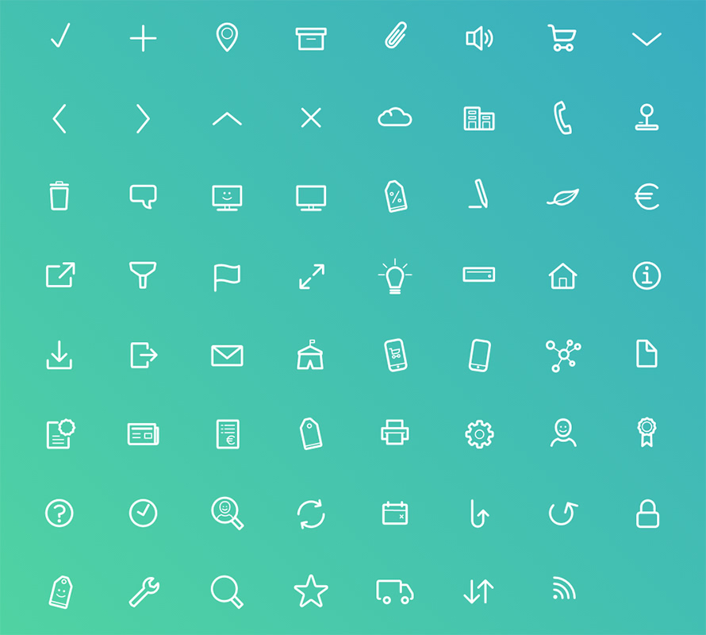

# iconcepts Round

Icon web font with rounded icons.

## Getting started

You have the following options to get **iconcepts Round**:

* Download the [latest release](https://github.com/designconcepts/iconcepts-round/releases/latest).
* Install with [Yarn](https://yarnpkg.com/): ```yarn add iconcepts-round```
* Install with [npm](https://www.npmjs.com/): ```npm install iconcepts-round```

## How to use

Add the compiled and minified CSS to the header of your HTML document.

```
<link rel="stylesheet" href="path/to/iconcepts-round/dist/iconcepts-round.min.css">
```

Use the icons in your project with this markup:

```
<span class="icr icr-name"></span>
```

In this example **name** is a placeholder for the icon you want to use. Visit our icon site (coming soon) to see all available icons and their class names.



## Copyright and License

Copyright [designconcepts GmbH](https://www.designconcepts.de/) under the [MIT license](LICENSE.md).


